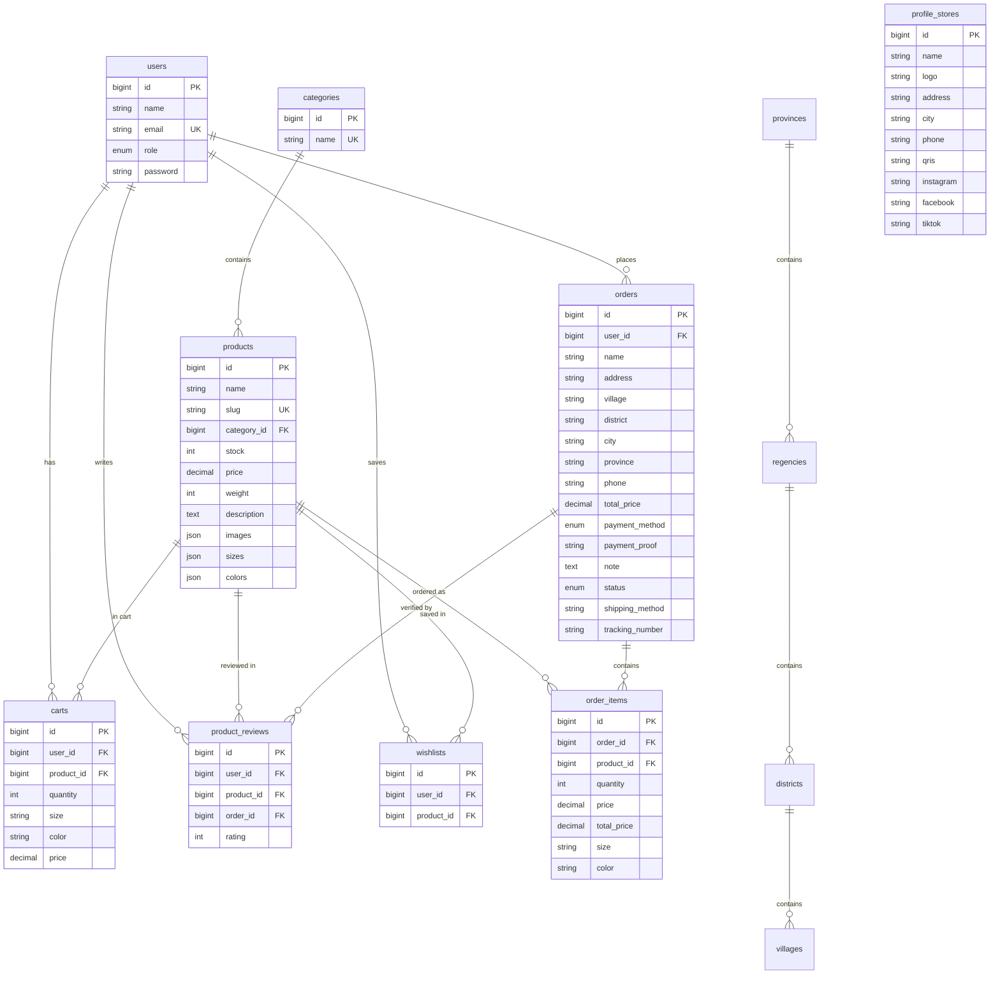

# Backend Schema — Nyuwi Creation

## Database
- **Engine:** MySQL (InnoDB)
- **PHP ORM:** Laravel Eloquent (Laravel 11)
- **Migration Policy:** Never edit existing migrations; create new ones for schema changes
- **Naming Conventions:** Plural snake_case tables, snake_case columns, PascalCase models

---

## Core E-Commerce Tables

### `users`
| Column | Type | Constraints | Notes |
|--------|------|-------------|-------|
| `id` | bigint | PK, auto-increment | |
| `name` | string | | |
| `email` | string | unique | |
| `role` | enum(`admin`, `pelanggan`) | default: `pelanggan` | `pelanggan` = customer |
| `email_verified_at` | timestamp | nullable | |
| `password` | string | | Hashed via Laravel |
| `remember_token` | string | nullable | |
| `created_at` | timestamp | | |
| `updated_at` | timestamp | | |

**Eloquent model:** `App\Models\User`
- Implements `MustVerifyEmail`
- `$fillable`: `name`, `email`, `password`, `role`
- `$hidden`: `password`, `remember_token`
- `casts()`: `email_verified_at → datetime`, `password → hashed`

### `categories`
| Column | Type | Constraints | Notes |
|--------|------|-------------|-------|
| `id` | bigint | PK, auto-increment | |
| `name` | string | unique | |
| `created_at` | timestamp | | |
| `updated_at` | timestamp | | |

**Eloquent model:** `App\Models\Category`
- `$fillable`: `name`

### `products`
| Column | Type | Constraints | Notes |
|--------|------|-------------|-------|
| `id` | bigint | PK, auto-increment | |
| `name` | string | | |
| `slug` | string | unique | URL-friendly identifier |
| `category_id` | bigint | FK → `categories.id` | |
| `stock` | integer | default: `0` | |
| `price` | decimal(10,2) | | IDR price |
| `weight` | integer | default: `0` | Shipping weight in grams |
| `description` | text | | |
| `images` | json | | Array of image paths |
| `sizes` | json | nullable | Available sizes (e.g., `["S","M","L"]`) |
| `colors` | json | nullable | Available colors |
| `created_at` | timestamp | | |
| `updated_at` | timestamp | | |

**Eloquent model:** `App\Models\Product`
- `$fillable`: `name`, `slug`, `category_id`, `stock`, `price`, `weight`, `description`, `images`, `sizes`, `colors`
- `casts()`: `images → array`, `sizes → array`, `colors → array`, `price → decimal:2`

### `carts`
| Column | Type | Constraints | Notes |
|--------|------|-------------|-------|
| `id` | bigint | PK, auto-increment | |
| `user_id` | bigint | FK → `users.id`, ON DELETE CASCADE | |
| `product_id` | bigint | FK → `products.id`, ON DELETE CASCADE | |
| `quantity` | integer | default: `1` | |
| `size` | string | nullable | Selected variant size |
| `color` | string | nullable | Selected variant color |
| `price` | decimal(10,2) | | Unit price at time of cart add |
| `created_at` | timestamp | | |
| `updated_at` | timestamp | | |

**Eloquent model:** `App\Models\Cart`
- `$fillable`: `user_id`, `product_id`, `quantity`, `price`, `size`, `color`

### `orders`
| Column | Type | Constraints | Notes |
|--------|------|-------------|-------|
| `id` | bigint | PK, auto-increment | |
| `user_id` | bigint | FK → `users.id`, ON DELETE CASCADE | |
| `name` | string | | Customer name snapshot |
| `address` | string | | Shipping address |
| `village` | string | | Village name |
| `district` | string | | District name |
| `city` | string | | City/regency name |
| `province` | string | | Province name |
| `phone` | string | | Customer phone |
| `total_price` | decimal(15,2) | | Order total |
| `payment_method` | enum(`digital_wallet`, `qris`) | default: `qris` | |
| `payment_proof` | string | nullable | Uploaded image path |
| `note` | text | nullable | Customer notes |
| `status` | enum | default: `waiting` | See status enum below |
| `shipping_method` | string | nullable | |
| `tracking_number` | string | nullable | |
| `created_at` | timestamp | | |
| `updated_at` | timestamp | | |

**Order status enum values:**
| Status | Meaning |
|--------|---------|
| `waiting` | Awaiting payment proof upload |
| `checking` | Payment proof under admin review |
| `pending` | Payment confirmed, awaiting processing |
| `processing` | Being prepared for shipment |
| `shiping` | Shipped (note: typo in migration — `shiping`, not `shipping`) |
| `completed` | Delivered / fulfilled |
| `cancelled` | Order cancelled |

**Eloquent model:** `App\Models\Order`
- `$fillable`: `user_id`, `name`, `address`, `city`, `district`, `village`, `province`, `phone`, `total_price`, `payment_method`, `payment_proof`, `note`, `status`, `shipping_method`, `tracking_number`

### `order_items`
| Column | Type | Constraints | Notes |
|--------|------|-------------|-------|
| `id` | bigint | PK, auto-increment | |
| `order_id` | bigint | FK → `orders.id`, ON DELETE CASCADE | |
| `product_id` | bigint | FK → `products.id`, ON DELETE CASCADE | |
| `quantity` | integer | | |
| `price` | decimal(10,2) | | Unit price at time of purchase |
| `total_price` | decimal(15,2) | | Line total (price × quantity) |
| `size` | string | nullable | |
| `color` | string | nullable | |
| `created_at` | timestamp | | |
| `updated_at` | timestamp | | |

**Eloquent model:** `App\Models\OrderItem`
- `$fillable`: `order_id`, `product_id`, `quantity`, `price`, `total_price`, `size`, `color`

### `product_reviews`
| Column | Type | Constraints | Notes |
|--------|------|-------------|-------|
| `id` | bigint | PK, auto-increment | |
| `user_id` | bigint | FK → `users.id`, ON DELETE CASCADE | Reviewer |
| `product_id` | bigint | FK → `products.id`, ON DELETE CASCADE | Reviewed product |
| `order_id` | bigint | FK → `orders.id`, ON DELETE CASCADE | Linked order (proves purchase) |
| `rating` | integer | | 1–5 star rating |
| `created_at` | timestamp | | |
| `updated_at` | timestamp | | |

**Eloquent model:** `App\Models\ProductReview`
- `$fillable`: `user_id`, `product_id`, `order_id`, `rating`

### `wishlists`
| Column | Type | Constraints | Notes |
|--------|------|-------------|-------|
| `id` | bigint | PK, auto-increment | |
| `user_id` | bigint | FK → `users.id`, ON DELETE CASCADE | |
| `product_id` | bigint | FK → `products.id`, ON DELETE CASCADE | |
| `created_at` | timestamp | | |
| `updated_at` | timestamp | | |

**Eloquent model:** `App\Models\Wishlist`
- `$fillable`: `user_id`, `product_id`

---

## Store Configuration Table

### `profile_stores`
| Column | Type | Constraints | Notes |
|--------|------|-------------|-------|
| `id` | bigint | PK, auto-increment | |
| `name` | string | | Store name |
| `logo` | string | | Logo image path |
| `address` | string | | Store address |
| `city` | string | | Store city |
| `phone` | string | | Store contact phone |
| `qris` | string | | QR code image path for payment |
| `instagram` | string | nullable | Instagram handle |
| `facebook` | string | nullable | Facebook page URL |
| `tiktok` | string | nullable | TikTok handle |
| `created_at` | timestamp | | |
| `updated_at` | timestamp | | |

**Eloquent model:** `App\Models\ProfileStore`
- `$fillable`: `name`, `logo`, `address`, `city`, `phone`, `qris`, `instagram`, `facebook`, `tiktok`

---

## Indonesian Region Tables (IndoRegion Package)

### `provinces`
| Column | Type | Constraints | Notes |
|--------|------|-------------|-------|
| `id` | char(2) | indexed | BPS province code; the migration does not declare a primary key |
| `name` | string | | Province name |

**Eloquent model:** `App\Models\Province` — uses `ProvinceTrait`

### `regencies`
| Column | Type | Constraints | Notes |
|--------|------|-------------|-------|
| `id` | char(4) | indexed | BPS regency code; the migration does not declare a primary key |
| `province_id` | char(2) | FK → `provinces.id`, ON UPDATE CASCADE, ON DELETE RESTRICT | |
| `name` | string(50) | | Regency/city name |

**Eloquent model:** `App\Models\Regency` — uses `RegencyTrait`
- `$hidden`: `province_id`

### `districts`
| Column | Type | Constraints | Notes |
|--------|------|-------------|-------|
| `id` | char(7) | indexed | BPS district code; the migration does not declare a primary key |
| `regency_id` | char(4) | FK → `regencies.id`, ON UPDATE CASCADE, ON DELETE RESTRICT | |
| `name` | string(50) | | District name |

**Eloquent model:** `App\Models\District` — uses `DistrictTrait`
- `$hidden`: `regency_id`

### `villages`
| Column | Type | Constraints | Notes |
|--------|------|-------------|-------|
| `id` | char(10) | indexed | BPS village code; the migration does not declare a primary key |
| `district_id` | char(7) | FK → `districts.id`, ON UPDATE CASCADE, ON DELETE RESTRICT | |
| `name` | string(50) | | Village name |

**Eloquent model:** `App\Models\Village` — uses `VillageTrait`
- `$hidden`: `district_id`

---

## Laravel Framework Tables

### `sessions`
| Column | Type | Constraints | Notes |
|--------|------|-------------|-------|
| `id` | string | PK | Session ID |
| `user_id` | bigint | nullable, indexed, FK → `users.id` | |
| `ip_address` | string(45) | nullable | IPv4/IPv6 |
| `user_agent` | text | nullable | |
| `payload` | longText | | Serialized session data |
| `last_activity` | integer | indexed | Unix timestamp |

### `password_reset_tokens`
| Column | Type | Constraints | Notes |
|--------|------|-------------|-------|
| `email` | string | PK | |
| `token` | string | | Hashed token |
| `created_at` | timestamp | nullable | |

### `cache`
Standard Laravel cache table (`key`, `value`, `expiration`).

### `jobs`
Standard Laravel queue jobs table.

### `personal_access_tokens` (Sanctum)
| Column | Type | Constraints | Notes |
|--------|------|-------------|-------|
| `id` | bigint | PK, auto-increment | |
| `tokenable_type` | string | | Polymorphic type |
| `tokenable_id` | bigint | | Polymorphic ID |
| `name` | string | | Token name |
| `token` | string(64) | unique | Hashed token |
| `abilities` | text | nullable | JSON array of abilities |
| `last_used_at` | timestamp | nullable | |
| `expires_at` | timestamp | nullable | |
| `created_at` | timestamp | | |
| `updated_at` | timestamp | | |

---

## Entity Relationships

---

## Relationships Summary

### Implemented Eloquent Relationships

| Model | Method | Related Model | Type |
|-------|--------|---------------|------|
| `User` | `cart()` | `Cart` | hasMany |
| `Category` | `products()` | `Product` | hasMany |
| `Product` | `category()` | `Category` | belongsTo |
| `Product` | `cartItems()` | `Cart` | hasMany |
| `Product` | `orderItems()` | `OrderItem` | hasMany |
| `Product` | `reviews()` | `ProductReview` | hasMany |
| `Cart` | `user()` | `User` | belongsTo |
| `Cart` | `product()` | `Product` | belongsTo |
| `Order` | `orderItems()` | `OrderItem` | hasMany |
| `OrderItem` | `order()` | `Order` | belongsTo |
| `OrderItem` | `product()` | `Product` | belongsTo |
| `ProductReview` | `user()` | `User` | belongsTo |
| `ProductReview` | `product()` | `Product` | belongsTo |
| `ProductReview` | `order()` | `Order` | belongsTo |
| `Wishlist` | `user()` | `User` | belongsTo |
| `Wishlist` | `product()` | `Product` | belongsTo |
| `Province` | `regencies()` | `Regency` | hasMany |
| `Regency` | `province()` | `Province` | belongsTo |
| `Regency` | `districts()` | `District` | hasMany |
| `District` | `regency()` | `Regency` | belongsTo |
| `District` | `villages()` | `Village` | hasMany |
| `Village` | `district()` | `District` | belongsTo |

### Database Foreign Keys Without a Reciprocal Eloquent Method

The database defines the following relationships, but the corresponding Eloquent methods are not currently present in the related models:

- `orders.user_id` → `users.id` (`Order::user()` and `User::orders()` are absent)
- `product_reviews.user_id` → `users.id` (`User::reviews()` is absent)
- `wishlists.user_id` → `users.id` (`User::wishlists()` is absent)
- `wishlists.product_id` → `products.id` (`Product::wishlists()` is absent)

All foreign keys in `carts`, `orders`, `order_items`, `product_reviews`, and `wishlists` use `ON DELETE CASCADE`; IndoRegion hierarchy foreign keys use `ON DELETE RESTRICT` and `ON UPDATE CASCADE`.

---

## Indexes
| Table | Column(s) | Type |
|-------|-----------|------|
| `users` | `email` | unique |
| `sessions` | `user_id` | index |
| `sessions` | `last_activity` | index |
| `products` | `slug` | unique |
| `personal_access_tokens` | `token` | unique |
| `personal_access_tokens` | `tokenable_type`, `tokenable_id` | polymorphic index |
| `provinces` | `id` | index (not declared primary) |
| `regencies` | `id` | index (not declared primary) |
| `districts` | `id` | index (not declared primary) |
| `villages` | `id` | index (not declared primary) |

---

## Recommended Validation Rules (Laravel Form Requests)

> These are documentation recommendations derived from the persisted schema. They are not a claim that the current controllers already use these exact Form Requests.

### Product
| Field | Rules |
|-------|-------|
| `name` | `required|string|max:255` |
| `slug` | `required|slug|unique:products,slug` |
| `category_id` | `required|exists:categories,id` |
| `stock` | `required|integer|min:0` |
| `price` | `required|numeric|min:0` |
| `weight` | `required|integer|min:0` |
| `description` | `required|string` |
| `images` | `required|array` |
| `sizes` | `nullable|array` |
| `colors` | `nullable|array` |

### Order
| Field | Rules |
|-------|-------|
| `name` | `required|string` |
| `address` | `required|string` |
| `village` | `required|string` |
| `district` | `required|string` |
| `city` | `required|string` |
| `province` | `required|string` |
| `phone` | `required|string` |
| `payment_method` | `required|in:digital_wallet,qris` |
| `note` | `nullable|string` |

### Cart
| Field | Rules |
|-------|-------|
| `product_id` | `required|exists:products,id` |
| `quantity` | `required|integer|min:1` |
| `size` | `nullable|string` |
| `color` | `nullable|string` |

### Product Review
| Field | Rules |
|-------|-------|
| `product_id` | `required|exists:products,id` |
| `order_id` | `required|exists:orders,id` |
| `rating` | `required|integer|min:1|max:5` |

---

## Migration Policy
1. **Never** edit existing migration files — always create new migrations for schema changes.
2. **Never** run `php artisan migrate:fresh` or `php artisan db:wipe` in production.
3. Use descriptive migration names that follow the pattern: `YYYY_MM_DD_HHMMSS_action_table.php`.
4. Foreign keys should use `constrained()` with explicit `onDelete` behavior where the default is not appropriate.
5. Always test migrations locally before deploying to staging or production.